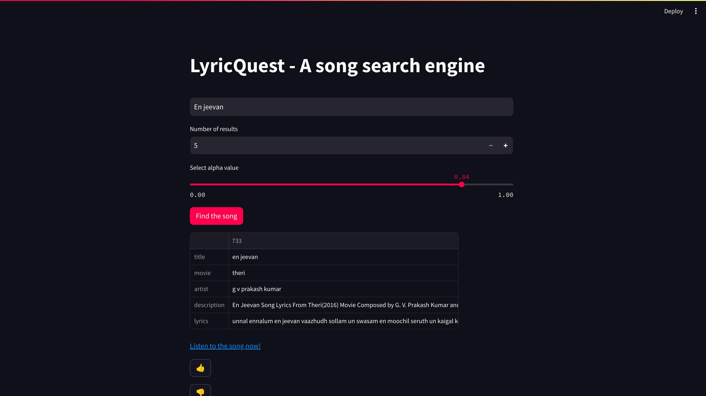
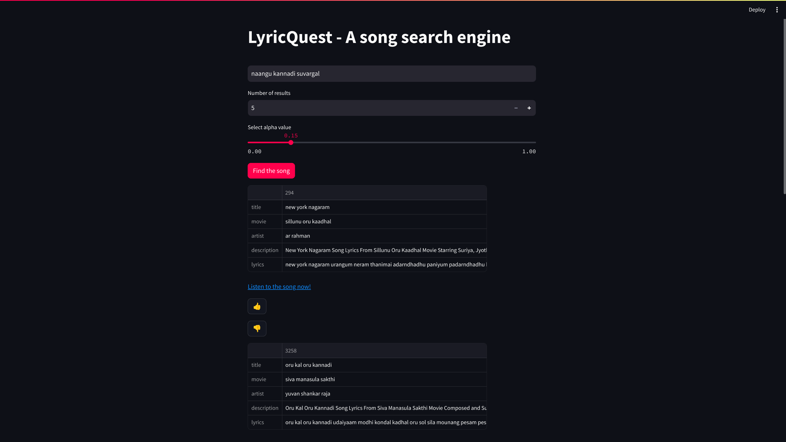

# LyricQuest

LyricQuest is a song search engine that allows users to search for songs based on phrases from the lyrics. This is our end semester project for the Course - 20XW86 Information Retrieval Lab.

## Features

- **Song Search:** Users can enter phrases from the lyrics to search for songs.
- **Interactive Interface:** Users can view detailed information about each song and interact with the search results by liking or disliking songs.

## Technologies Used

- **Python:** The backend of LyricQuest is built using Python, leveraging libraries such as Pandas, NumPy, and Scikit-learn for data processing and analysis.
- **Streamlit:** LyricQuest uses Streamlit to create a web-based interface for users to interact with the application.
- **MySQL:** The song data and user interactions are stored in a MySQL database.
- **NLTK:** NLTK is used for text processing tasks such as tokenization and stemming.
- **BS4:** Beautiful Soup to fetch the youtube video link of the retrieved song.
- **Git:** Version control for managing the project codebase.

## Installation

To run LyricQuest locally, follow these steps:

1. Clone the repository:

   ```
   git clone https://github.com/karthiksmanian/LyricQuest.git
   ```

2. Install dependencies:

   ```
   pip install -r requirements.txt
   ```

3. Set up the MySQL database and configure the connection in `app.py`.

4. Run the utils script to generate the pkl file.

5. Run the application:

   ```
   streamlit run app.py
   ```

## Working

1. Title weighted matching
   

2. Lyrics weighted matching
   

## Contributors

20PW01 - Abishek A.
20PW16 - Karthik Manian S.
